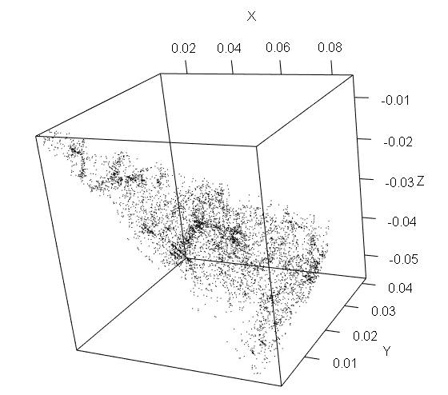
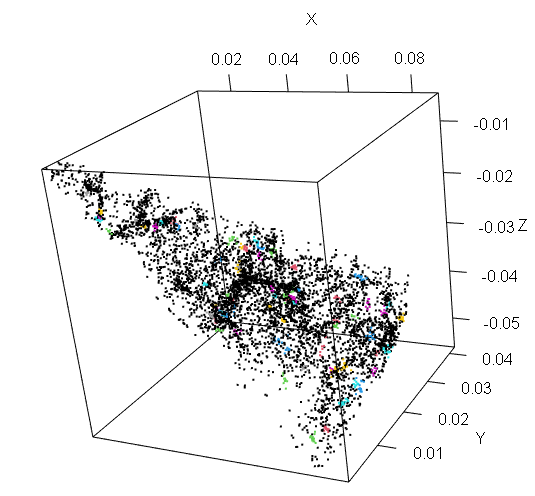
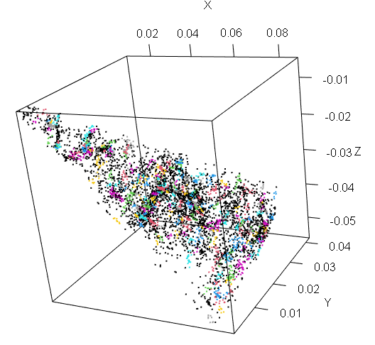
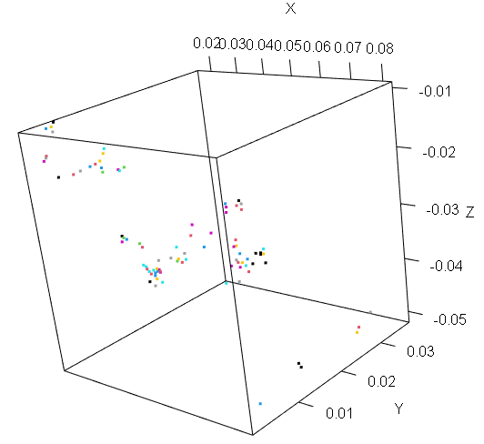
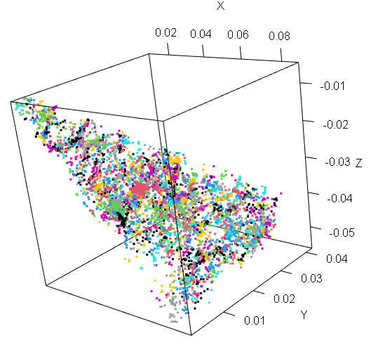

```{r setup, include=FALSE}
knitr::opts_chunk$set(echo = TRUE)
```

```{r echo=FALSE, message=FALSE, warning=FALSE}

if (!require('jsonlite')) install.packages('jsonlite')
library(jsonlite)
if (!require('dbscan')) install.packages('dbscan')
library(dbscan)
if (!require('readr')) install.packages('readr')
library(readr)
if (!require('rjson')) install.packages('rjson')
library(rjson)

if (!require('dplyr')) install.packages('dplyr')
library(dplyr)

if (!require('akima')) install.packages('akima')
library(akima)

if (!require('astrolibR')) install.packages("astrolibR")
library(astrolibR)

if (!require('scatterplot3d')) install.packages("scatterplot3d")
library(scatterplot3d)

if (!require('gMOIP')) install.packages("gMOIP")
library(gMOIP)

if (!require('ggplot2')) install.packages("ggplot2")
library(ggplot2)

if (!require('rgl')) install.packages("rgl")
library(rgl)

if (!require('pracma')) install.packages("pracma")
library(pracma)

if (!require('plotly')) install.packages("plotly")

library(plotly)

if (!require('sqldf')) install.packages("sqldf")
library(sqldf)

if (!require('tidyr')) install.packages("tidyr")
library(tidyr)

if (!require('densityClust')) install.packages('densityClust')
library(densityClust)

if (!require('densityClust')) install.packages('densityClust')
library(densityClust)

#Heat map in DPC
if (!require('RColorBrewer')) install.packages('RColorBrewer')
library(RColorBrewer)

```

# The clustering problem on galaxy dataset

Rather than pursuing a traditional unsupervised clustering optimization---such as variance maximization via the **Elbow Method**---this work evaluates the efficacy of **density-based clustering algorithms** in replicating a physically motivated **halo-based group finder**.

We aim to identify the optimal hyperparameter configurations that allow these algorithms to recover the underlying **dark matter halo membership** of galaxies, effectively using the halo-based catalog as a benchmark for physical validity.

# Loading data files

## Galaxy catalog for 2dFGRS

```{r echo=FALSE, message=FALSE, warning=FALSE}
######################
#     Galaxy 2dFGRS loading # 
######################

folder <- Sys.getenv('PROJECT_TFM')
includes_folder  <- sprintf('%s\\R\\includes\\', folder)
folder <- Sys.getenv('PROJECT_TFM')
folder <- sprintf('%s/data/2dfgrs/', folder)
file <- '2dfgrs-valid.csv'
setwd(folder)
dt <- read.csv(file)
str(dt)
```

# Generic functions for assessments

## Functions to asses outcomes

To assess the outcomes we will based our analysis on tree basic concepts:

**Purity(P)**: measure of output-cluster: proportion of members coming exclusively from a single true group, providing confidence that the algorithm correctly groups members together. A high purity rate indicates the algorithm's effectiveness in identifying true groups.

**Completeness (C)**: measure of an output-cluster: proportion of data true-group elements included in an output-cluster. A cluster is "complete" if contains all points of the original true group.

**Recovery (R)**: measure of an output-cluster (much more restrictive): proportion of output-clusters which are both pure and complete. For this study we consider an output-cluster to be pure if P\>=0.66 (at least 2/3 of elements of an output-cluster belong to a single group). An original cluster is complete if C\>=0.5 (at least half data belong to an original true group).

Some other stats are:

**total_in_group:** number of elements in a given group.

**total_in_cluster:** number of elements in a given output-cluster.

**total_in_cluster_group:** number of elements in a given output-cluster belonging to a majority-group.

**undetected_groups**: original groups not detected as majority-group in output-clusters.

**detected_groups**: original groups detected as majority-group in output-clusters.

Following code is aimed to asses the outcomes obtained with from an given output-cluster:

```{r}
sys.source(sprintf("%s\\assess.r", includes_folder), envir = knitr::knit_global())
```

Following code is intended to calculate stats

```{r}
sys.source(sprintf("%s\\calculate_stats.r", includes_folder), envir = knitr::knit_global())
```

We generated some functions to help us visualize the results graphically:

```{r}
sys.source(sprintf("%s\\plotting_functions.r", includes_folder),  envir = knitr::knit_global())
```

Last file to include content function to compute slos distance:

```{r}
sys.source(sprintf("%s\\slos.r", includes_folder),  envir = knitr::knit_global())
```

# Data Preprocessing

## Descriptive analysis **and visualization**

There is an initial pre-processing of data-file in order to obtain proper distances and Cartesian coordinates x,y,z, by now it is omitted here.

Take a sample bounded by minPts = 5 and in RA and DEC:

$$RA \in [0, 2]h,\, DEC \in [-36, -25]º,\, \,and\,\, z \lt max\_redshift$$

Then we take the initial values and take a look at the remaining distribution:

```{r}
SLOS <- 0 #Here the slos is not fixed beforehand
min_members <- 5
max_redshift <- 0.1
min_redshift <- 0.0
ra_lim_inf <-  0
ra_lim_sup <- 30
dec_lim_inf <- -36
dec_lim_sup <-  -25

# Take a sample using boundaries
mm <- dt[ dt$ra<= ra_lim_sup & dt$ra>=ra_lim_inf & 
            dt$dec>= dec_lim_inf & dt$dec<=dec_lim_sup &
            dt$redshift< max_redshift & dt$redshift> min_redshift,]


# mm is an object containing both groups and galaxy identification
ggplot(mm, aes(x=redshift, y=redshift))+geom_violin()
```

```{r}
dim(mm)
```

Select groups with more than min_members members queries:

```{r}
h<-sqldf("select 
            count(GAL_ID) as members, 
            GROUP_ID 
          from 
            mm 
          group by 
            GROUP_ID 
          order by  
            members desc")
mm5<-sqldf(sprintf("
    SELECT 
        mm.GAL_ID,
        mm.x, 
        mm.y, 
        mm.z, 
        mm.GROUP_ID, 
        mm.redshift, 
        mm.dist
      FROM 
        mm as mm, h 
      where 
          mm.GROUP_ID=h.GROUP_ID and 
          h.members >= %s"
      , min_members))

```

Then use it to find the target data:

```{r}

true_groups <- length(unique(mm5$GROUP_ID))
number_non_isolated_galaxies <- dim(mm5)[1]
number_isolated_galaxies <- dim(mm)[1] - dim(mm5)[1]
print(sprintf('Number of galaxies in groups with 
              more than %s elements %s out of %s, aprox %s percent', 
          min_members, 
          number_non_isolated_galaxies, 
          dim(mm)[1], format(number_non_isolated_galaxies * 100
                                /dim(mm)[1], digits=4)))
print(sprintf("Number of groups with more than %s members: %s", 
              min_members, 
              true_groups))
```

We take a look at the groups with more than min_members:

```{r}
hhh<- h[h$members>=min_members, ]
ttable <- table(hhh$GROUP_ID, hhh$members)
barplot(ttable, col=('red'), 
        main=sprintf("Group distribution (%s) with at least %s members ", 
                     true_groups, 
                     min_members))
```

```{r}
boxplot(hhh$members, main="Boxplot of num of members in groups")
```

Lets take a look at the complete target sample:

```{r}
plot3d(mm$x, mm$y, mm$z, col = 'black', 
       size = 1, xlab = "X", ylab = "Y", zlab = "Z")
```



```{r}
aa <- sqldf("select 
	  	  GAL_ID,
	      x, 
	      y, 
	      z, 
		    case 
  			  when group_id IN (Select GROUP_ID from mm5) then group_id
	      else 0
		    end as group_id, 
	      redshift, 
	      dist
	  from 
		    mm")

plot3d(aa$x, aa$y, aa$z, col = aa$group_id+1, 
       size = 2, xlab = "X", ylab = "Y", zlab = "Z")
```

And the groups with more than min_members:

```{r}
plot3d(mm5$x, mm5$y, mm5$z, col = mm5$GROUP_ID, 
       size = 2, xlab = "X", ylab = "Y", zlab = "Z")
```


# Raw data processing

We will process the data without any kind of scale or normalization.

## OPTICS

Optics clustering:

```{r}
points<- mm[,c('x', 'y', 'z')]

#clustering
res <- optics(points, minPts = min_members)
plot(res)

```

In the previous plot we can see how OPTICS modeling valleys (clusters) and the peaks (cluster-separation).

Execute extractXI to obtain a hierarchical clustering with $\xi=0.15$:

```{r}
optics <- extractXi(res, xi=0.15)
plot(optics)
```

### Output-clusters visualization

Take a plot of the clustering obtained:

```{r}
plot3D_cluster(optics, mm)
```



As shown, this method do not work in clustering detection.

Stats with different values:

```{r}
mm$cluster_id <- as.numeric(optics$cluster)
mm5 <- get_elements_in_m5_groups(mm)
all <- execute_stats(mm, optics)
print_stats(all)
```

## DBSCAN

We can directly apply extractDBSCAN on the OPTICS model.

```{r}
blo_scan <- extractDBSCAN(res, eps_cl = 0.00075)
mm$cluster_id <- blo_scan$cluster
mm5 <- get_elements_in_m5_groups(mm)
plot(blo_scan)
```

### Output-clusters visualization

We have, on one hand all groups with more than min_members members (made up by a reduced amount of galaxies from catalog)

in the other hand the output-clusters from DBSCAN:

```{r}
plot3D_cluster(blo_scan, points)
```


```{r}
all <- execute_stats(mm, blo_scan)
head(all, 5)

```

```{r}
print_stats(all)
```

We can now test over different values in order to obtain optimal eps_cl hyper-parameter:

```{r}
#It is easy to transform onto a function which admits a sequence and a res set.
eps_sequence_test <- seq(0.0004, 0.001, 0.0002)
x_stats <- extract_stats_dbscan(eps_sequence_test, res)
```

Show the results obtained:

```{r}
print_global_stats(x_stats, eps_sequence_test)

```

Lets get a plots for completeness and purity:

We have the optimal point at $\epsilon = 6.10^{-4}$, \$ where recovery =50% and completeness= 87% purity=65%

```{r}
seleced_eps <- 0.0006
plot_purity_completeness(
  eps_sequence_test, 
  x_stats$purity_list, 
  x_stats$completeness_list, 
  x_stats$recovery,
  c('Purity', 'Completeness', 'Recovery'),
  "Purity/completeness on not scaled data",
  seleced_eps, 'eps', 'Percentage'
)
```

This chart shows that optimal point is around $0.0006$. Is at this value where completeness is maximum and purity is still high.

```{r}

plot_purity_completeness(
  eps_sequence_test, 
  x_stats$pures/true_groups, 
  x_stats$und_gr/true_groups, 
  x_stats$pure_complet/true_groups,
  c('Purity', 'Undetected gr.', 'Pure + Complet.'),
  "Group global group purity and undetected stats on not scaled data",
  seleced_eps , 'eps', 'Percentage'
)
```

For groups detection, we have:

```{r}
plot_purity_completeness(
  eps_sequence_test, 
  x_stats$und_gr,
  x_stats$group_list, 
  true_groups - x_stats$und_gr,
  c('Undetected', 'Groups', 'Detected'),
  "Total purity and completeness on scaled data",
   seleced_eps , 'eps', 'Groups number'
)
```

# HDBSCAN data processing

As said from theory, HDBSCAN does not generate a great model because it ability to detect clusters in sparse areas. It cause detect noise as clusters.

```{r}
cl <- hdbscan(points, minPts = 5)
length(unique( cl$cluster))
```

## Output-clusters visualization

```{r}
plot3D_cluster(cl, mm)
```



HDBSCAN do not work pretty well because it detects cluster in sparser areas which gives as a result cluster detection on noise regions.

# Density Peaks Clustering(DPC )

Alex Rodriguez and Alessandro Laio (2014).

<https://github.com/thomasp85/densityClust>

By making this way it appears some clusters:

```{r}
galaxyDens <- densityClust(points)
galaxyClusters <- findClusters(galaxyDens, rho=0.997, delta=0.00086)
plot(galaxyClusters)

# do not use this takes a lot!!:
#plotMDS(galaxyClusters)

mm$cluster_id <- galaxyClusters$cluster
```

```{r}
all <- execute_stats(mm, galaxyClusters)
print_stats(all)

```

DPC is analogous to HDBCAN: the model do not fit well for the same reason: detecting clusters in noise regions.

May be DPC is not good in finding cluster but it can be useful in finding the centers by finding the peaks of density, as we show bellow:

```{r}
galaxyClusters <- findClusters(galaxyDens, rho=0.9985, delta=0.00084)
peaks <- mm[galaxyClusters$peaks,]
print(sprintf("DPC detected %s out of %s clusters", length(unique(peaks$GROUP_ID)), true_groups))
```

In fact we can create a heat-map for $\rho$ and $\delta$ hyper-parameters:

```{r}

rhos <- seq(0.9980, 0.999, 0.0001)
deltas <- seq(0.0008, 0.0009, 0.00001)

ll <-  length(deltas)
j<-1
i<-ll

matrix_data=matrix(ncol=length(rhos), nrow = length(deltas)) 
for (rho in rhos){
	for (delta in deltas){
        galaxyClusters <- findClusters(galaxyDens, rho=rho, delta=delta)
        peaks <- mm[galaxyClusters$peaks,]
        l <- length(unique(peaks$GROUP_ID))
        #print(min(l/true_groups, true_groups/l))
        matrix_data[i, j] <- min(l/true_groups, true_groups/l)
        #matrix_data[j, i] <- min(l/true_groups, true_groups/l)
        i <- i-1
    }
    j <- j+1
    i<-ll
}


custom_heatmap(matrix_data, deltas, rhos, xTitle = "rho", yTitle = "delta", numColors = 11)
```

In which case, we can see that \$\\delta=0.00083\$\$ and $\rho=0.9985$ produce the best results with a 97% of group-centers detection.

## Output-clusters visualization

```{r}
galaxyClusters <- findClusters(galaxyDens, rho=0.9985, delta=0.00083)
peaks <- mm[galaxyClusters$peaks,]
plot3d(peaks$x, peaks$y, peaks$z, col = peaks$GROUP_ID+1, 
         size = 3, xlab = "X", ylab = "Y", zlab = "Z")
```



And decision graph remains finally:

```{r}
plot(galaxyClusters)
abline(h =0.00084, lty = 5)
abline(v=0.9985, col="blue")
```

Note that DPC is good in obtaining groups centers but not in separate the groups over the global datase as we can see

```{r}
plot3d(mm$x, mm$y, mm$z, col = mm$cluster_id+1, 
       size = 3, xlab = "X", ylab = "Y", zlab = "Z")
```



# Normalized data processing

We will perform a scale of data:

```{r}
points_scaled <- scale(points)
ress <- optics(points_scaled, minPts = min_members)
#optimal value obtained
blo_scans <- extractDBSCAN(ress, eps_cl = 0.025)
mm$cluster_id <- blo_scans$cluster
mm5 <- get_elements_in_m5_groups(mm)
```

Again we can do the same for scaled data:

```{r}
eps_sequence_test <- seq(0.035, 0.06, 0.005)
x_stats <- extract_stats_dbscan(eps_sequence_test, ress)
```

```{r}
print_global_stats(x_stats, eps_sequence_test)
```

Results look sligthly better when all variables are scaled to a mean=0, sd=1. The optimal value of eps gives more than 81% and 72% for completeness and purity respectively .

The same plots before

```{r}
seleced_eps <- 0.04
plot_purity_completeness(
    eps_sequence_test, 
    x_stats$purity_list,
    x_stats$completeness_list,
    x_stats$recovery, 
    c('Purity', 'Completeness', 'Recovery'),
    "Group purity and undetected stats on not scaled data",
    seleced_eps, 'eps', 'Percentage'
)

```

```{r}
plot_purity_completeness(
  eps_sequence_test, 
  x_stats$und_gr,
  x_stats$group_list, 
  true_groups - x_stats$und_gr,
  c('Undetected', 'Groups', 'Detected'),
  "Purity and completeness on scaled data",
   seleced_eps, 'eps', 'Groups number'
)
```

## Hyper-parameter tunning by the elbow method

We have selected that minPts = min_members, which is a reasonable value for interpreting a group / clustering.

From the DBSCAN theory we can use the elbow on:

```{r}
kNNdistplot(x = points_scaled, k = min_members)
abline(h =seleced_eps, lty = 3) 
```

How reader can see, the "elbow method" does not apply here, the reason for this is that we are not trying to optimize the clusters given by the algorithm, instead we are trying to detect groups of galaxies classified by the .

In addition are data belonging to actual clusters with more than min_members members, this reduced the space to 774 galaxies out of more than 5000.

We can infer that optimal value is content within the interval (0.0023, 0.0033).

## Undetected original groups

The element whose groups were not detected are:

```{r}
blo_scans <- extractDBSCAN(ress, eps_cl = seleced_eps)
mm$cluster_id <- blo_scans$cluster

all <- execute_stats(mm, blo_scans)

undetected <- get_elements_not_in_groups(mm5, all)
detected <- get_elements_in_groups(mm, all)

print(sprintf('Undetected groups: %s', length(unique(undetected$GROUP_ID))))
print(sprintf('Detected groups: %s', length(unique(detected$GROUP_ID))))
```

Plot detected groups

```{r}
plot3d(detected$x, detected$y, detected$z, 
       col = detected$GROUP_ID +1, size = 2, 
       xlab = "X", ylab = "Y", zlab = "Z")
```


Plot undetected groups

```{r}
plot3d(undetected$x, undetected$y, undetected$z, 
       col = undetected$GROUP_ID, size = 2, 
       xlab = "X", ylab = "Y", zlab = "Z")
```


# s-Distances (SLos application)

We will use the code to calculate the s-distance, which consists in make a elongation along the line of sight.

## sDistances Matrix Calculation

We can calculate distance matrix to apply OPTICS to this new metric, executing following code may take a long time:

```{r}
a<- mm[,c('x', 'y', 'z', 'dist', 'redshift')]
distance_matrix <- get_matrix_of_distances(a)
#Following code last a long time to execute
dist_object <- as.dist(distance_matrix)

```

## OPTICS

Apply OPTICS algoritim and then obtain a reachability plot:

```{r}
sres <- optics(dist_object, minPts = min_members)
plot(sres)
```

## DBSCAN:

Extract DBSCAN:

```{r}
sblo_scan <- extractDBSCAN(sres, eps_cl = 0.00025)
mm$cluster_id <- sblo_scan$cluster
#mm5 <- get_elements_in_groups(mm)
plot(sblo_scan)
```

We obtain a notable improvement comparing previous results:

```{r}
sall <- execute_stats(mm, sblo_scan)
print_stats(sall)
```

Test several hyper-parameters:

```{r}
#optimal value found at 0.00015
eps_sequence_test <- seq(0.000095, 0.00020, 0.00005)
sx_stats <- extract_stats_dbscan(eps_sequence_test, sres)

```

```{r}
print_global_stats(sx_stats, eps_sequence_test)
```

We get to the best value:

```{r}
seleced_eps <- 0.000108
plot_purity_completeness(
  eps_sequence_test, 
  sx_stats$purity_list, 
  sx_stats$completeness_list,
  sx_stats$recovery,
  c('Purity', 'Completeness', 'Recovery'),
  'Purity Completeness on Slos data',
  seleced_eps, 'eps', 'Percentage'
)
```

There is a notable improvement of the results with the sLos distances.

Finally, for groups detection:

```{r}

plot_purity_completeness(
  eps_sequence_test, 
  sx_stats$pures/true_groups, 
  sx_stats$pure_complet/true_groups, 
  sx_stats$completes/true_groups,  
  c('Purity', 'Completeness', 'Pur.+Comp.'),
  "Purity and completeness on scaled data",
  seleced_eps, 'eps', 'Percentage'
  )

```

```{r}
plot_purity_completeness(
  eps_sequence_test, 
  sx_stats$und_gr,
  sx_stats$group_list, 
  true_groups - sx_stats$und_gr,
  c('Undetected', 'Groups', 'Detected'),
  "Purity and completeness on scaled data",
   seleced_eps, 'eps', 'Groups number'
)

```

Detected and undetected groups:

```{r}

sblo_scan <- extractDBSCAN(sres, eps_cl = seleced_eps)
mm$cluster_id <- sblo_scan$cluster

all <- execute_stats(mm, sblo_scan)

undetected <- get_elements_not_in_groups(mm5, all)
detected <- get_elements_in_groups(mm, all)

print(sprintf('Undetected groups: %s', length(unique(undetected$GROUP_ID))))
print(sprintf('Detected groups: %s', length(unique(detected$GROUP_ID))))
```

Plot for detected groups:

```{r}
plot3d(detected$x, detected$y, detected$z, 
       col = detected$GROUP_ID +1, size = 2, 
       xlab = "X", ylab = "Y", zlab = "Z")
```


Plot for not detected groups:

```{r}
plot3d(undetected$x, undetected$y, undetected$z, 
       col = undetected$GROUP_ID +1, size = 2, 
       xlab = "X", ylab = "Y", zlab = "Z")
```


# Summary and conclusions

The bests results obtained with each method we summarize in next table:

+-------------------------------+----------------+-----------------------------+--------------------------------------------------------------------------+
| Method                        | Data Sample    | Outcomes                    | Conclusion                                                               |
+===============================+================+=============================+==========================================================================+
| OPTICS                        | Non-scaled     | \-                          | Good in cluster reachability plot                                        |
+-------------------------------+----------------+-----------------------------+--------------------------------------------------------------------------+
| OPTICS Xi hierarchical method | Non-scaled     | Not applicable.             | Not valuable result were found.                                          |
+-------------------------------+----------------+-----------------------------+--------------------------------------------------------------------------+
| DBSCAN                        | Non-scaled     | P: 0.65                     | Good in cluster detection but low recovery.                              |
|                               |                |                             |                                                                          |
|                               |                | C: 0.87                     |                                                                          |
|                               |                |                             |                                                                          |
|                               |                | R: 0.42                     |                                                                          |
|                               |                |                             |                                                                          |
|                               |                | U: 21                       |                                                                          |
+-------------------------------+----------------+-----------------------------+--------------------------------------------------------------------------+
| HDBSCAN                       | Non-scaled     | \-                          | Not good in cluster detection.                                           |
+-------------------------------+----------------+-----------------------------+--------------------------------------------------------------------------+
| DPC                           | Non-scaled     | 97% group-center detection. | Good in group center detection, but not in clustering the whole dataset. |
|                               |                |                             |                                                                          |
|                               |                |                             | $\delta=0.00084$ and $\rho=0.9985$                                       |
+-------------------------------+----------------+-----------------------------+--------------------------------------------------------------------------+
| **sOPTICS**                   | **Non-scaled** | **P: 0.84**                 | **Good on group detection with**                                         |
|                               |                |                             |                                                                          |
|                               |                | **C: 0.84**                 | **eps=0.000108**                                                         |
|                               |                |                             |                                                                          |
|                               |                | **R: 0.86**                 |                                                                          |
|                               |                |                             |                                                                          |
|                               |                | **U: 12**                   |                                                                          |
+-------------------------------+----------------+-----------------------------+--------------------------------------------------------------------------+
| OPTICS                        | Scaled         | \-                          | Good in cluster reachability plot                                        |
+-------------------------------+----------------+-----------------------------+--------------------------------------------------------------------------+
| DBSCAN                        | Scaled         | P: 0.72                     | Good in cluster detection with                                           |
|                               |                |                             |                                                                          |
|                               |                | C: 0.81                     | eps = 0.04                                                               |
|                               |                |                             |                                                                          |
|                               |                | R: 0.41                     |                                                                          |
|                               |                |                             |                                                                          |
|                               |                | U: 22                       |                                                                          |
+-------------------------------+----------------+-----------------------------+--------------------------------------------------------------------------+

# Executive summary

In conclusion. We took for this study a sample from the 2dFGRS catalog and selected 6173 objects within an area between 0 and 2h in RA and -25 and -36º in DEC. We tried several methods in groups detecting selecting groups with a minimum of 5 elements (galaxies), we got 95 groups.

We can stand out the following points:

-   The method sOPTICS with DBSCAN reached the highest values in completeness, purity and recovery and in group detection.

-   The DPC algorithm worked pretty well in group-center detection (reached a 97%), but did not worked in separate the groups in the whole dataset.

-   A normalization or scaled of data data slightly improve results, this is because all data are in fact in approx. in same scale, given that all coordinates: x, y, z and dist are all of them expressed under same units and in same range of values.

Finally we compare the original with the best clustering obtained in this study:

+--------------------------------+--------------------------------------+
| Actual groups distribution     | Best cluster detection with sOPTICS. |
+================================+======================================+
|  |        |
+--------------------------------+--------------------------------------+
