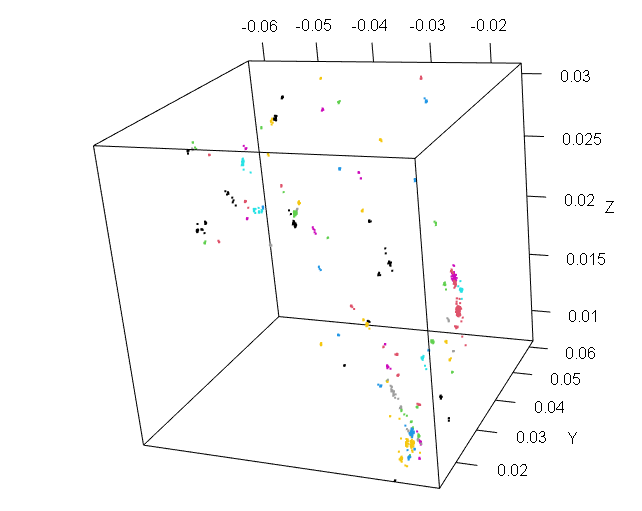
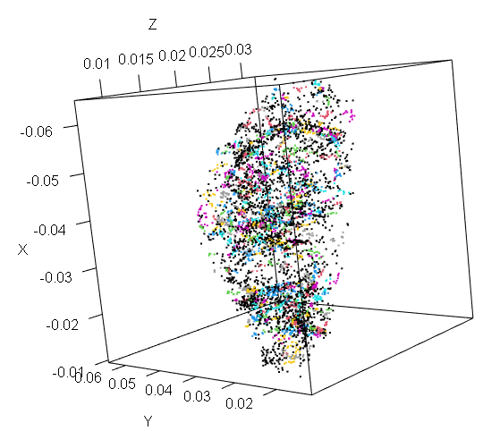
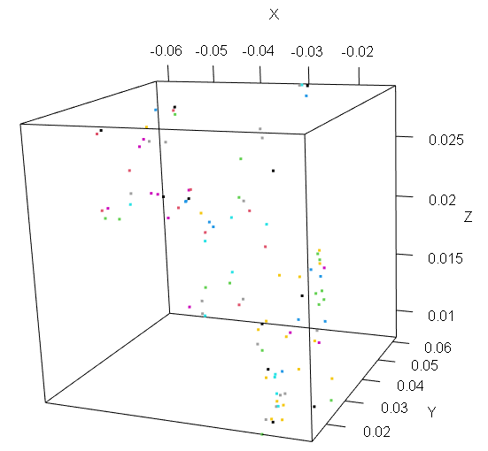
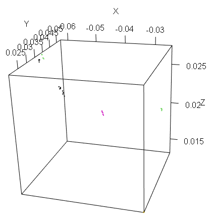

```{r setup, include=FALSE}
knitr::opts_chunk$set(echo = TRUE)
```

```{r echo=FALSE, message=FALSE, warning=FALSE}

if (!require('jsonlite')) install.packages('jsonlite')
library(jsonlite)
if (!require('dbscan')) install.packages('dbscan')
library(dbscan)
if (!require('readr')) install.packages('readr')
library(readr)
if (!require('rjson')) install.packages('rjson')
library(rjson)

if (!require('dplyr')) install.packages('dplyr')
library(dplyr)

if (!require('akima')) install.packages('akima')
library(akima)

if (!require('astrolibR')) install.packages("astrolibR")
library(astrolibR)

if (!require('scatterplot3d')) install.packages("scatterplot3d")
library(scatterplot3d)

if (!require('gMOIP')) install.packages("gMOIP")
library(gMOIP)

if (!require('ggplot2')) install.packages("ggplot2")
library(ggplot2)

if (!require('rgl')) install.packages("rgl")
library(rgl)

if (!require('pracma')) install.packages("pracma")
library(pracma)

if (!require('plotly')) install.packages("plotly")

library(plotly)

if (!require('sqldf')) install.packages("sqldf")
library(sqldf)

if (!require('tidyr')) install.packages("tidyr")
library(tidyr)

if (!require('densityClust')) install.packages('densityClust')
library(densityClust)

if (!require('densityClust')) install.packages('densityClust')
library(densityClust)

#Heat map in DPC
if (!require('RColorBrewer')) install.packages('RColorBrewer')
library(RColorBrewer)

```

# The clustering problem on galaxy dataset

Rather than pursuing a traditional unsupervised clustering optimization---such as variance maximization via the **Elbow Method**---this work evaluates the efficacy of **density-based clustering algorithms** in replicating a physically motivated **halo-based group finder**.

We aim to identify the optimal hyperparameter configurations that allow these algorithms to recover the underlying **dark matter halo membership** of galaxies, effectively using the halo-based catalog as a benchmark for physical validity.

Loading data files

## Galaxy catalog for Real-SDSS

```{r echo=FALSE, message=FALSE, warning=FALSE}
######################
#     Galaxy SDSS loading # 
######################
folder <- Sys.getenv('PROJECT_TFM')
includes_folder  <- sprintf('%s\\R\\includes\\', folder)
folder <- sprintf('%s\\data\\sdss\\', folder)
print(folder)
file <- sprintf('%sSDSS7-valid-real.csv', folder)
setwd(folder)
dt <- read.csv(file)
str(dt)
```

# Generic functions for assessments

## Functions to asses outcomes

To assess the outcomes we will based our analysis on tree basic concepts:

**Purity(P)**: measure of output-cluster: proportion of members coming exclusively from a single true group, providing confidence that the algorithm correctly groups members together. A high purity rate indicates the algorithm's effectiveness in identifying true groups.

**Completeness (C)**: measure of an output-cluster: proportion of data true-group elements included in an output-cluster. A cluster is "complete" if contains all points of the original true group.

**Recovery (R)**: measure of an output-cluster (much more restrictive): proportion of output-clusters which are both pure and complete. For this study we consider an output-cluster to be pure if P\>=0.66 (at least 2/3 of elements of an output-cluster belong to a single group). An original cluster is complete if C\>=0.5 (at least half data belong to an original true group).

Some other stats are:

**total_in_group:** number of elements in a given group.

**total_in_cluster:** number of elements in a given output-cluster.

**total_in_cluster_group:** number of elements in a given output-cluster belonging to a majority-group.

**undetected_groups**: original groups not detected as majority-group in output-clusters.

**detected_groups**: original groups detected as majority-group in output-clusters.

Following code is aimed to asses the outcomes obtained with from an given output-cluster:

```{r}
sys.source(sprintf("%s\\assess.r", includes_folder), envir = knitr::knit_global())
```

Following code is intended to calculate stats

```{r}
sys.source(sprintf("%s\\calculate_stats.r", includes_folder), envir = knitr::knit_global())
```

We generated some functions to help us visualize the results graphically:

```{r}
sys.source(sprintf("%s\\plotting_functions.r", includes_folder),  envir = knitr::knit_global())
```

Last file to include content function to compute slos distance:

```{r}
sys.source(sprintf("%s\\slos.r", includes_folder),  envir = knitr::knit_global())
```

# Data Preprocessing

## Descriptive analysis and visualization

There is an initial preprocessing of data-file in order to obtain proper distances and cartesian coordinates x,y,z, by now it is omitted here.

Take a sample bounded by minPts = 5 and RA and DEC:

$$RA \in [90, 150],\, DEC \in [15, 25],\, \,and\,\, z \lt max\_redshift$$

Then we take the initial values and take a look at the remaining distribution:

```{r}
min_members <- 5

ra_lim_inf <- 90
ra_lim_sup <- 150

dec_lim_inf <- 15
dec_lim_sup <-  25

max_redshift <- 0.08
min_redshift <- 0.025

# Take a sample using boundaries
mm <- dt[ dt$ra<= ra_lim_sup & dt$ra>=ra_lim_inf & 
            dt$dec>= dec_lim_inf & dt$dec<=dec_lim_sup &
            dt$redshift< max_redshift & dt$redshift> min_redshift,]


# mm is an object containing both groups and galaxy identification
ggplot(mm, aes(x=redshift, y=redshift))+geom_violin()
```

```{r}
dim(mm)
```

Select groups with more than min_members members queries:

```{r}

h<-sqldf("select 
            count(GAL_ID) as members, 
            GROUP_ID 
          from mm 
          group by GROUP_ID 
          order by  members desc")

mm5<-sqldf(sprintf("
    SELECT 
        mm.GAL_ID,
        mm.x, 
        mm.y, 
        mm.z, 
        mm.GROUP_ID, 
        mm.redshift, 
        mm.dist
      FROM 
        mm as mm, h 
      where 
          mm.GROUP_ID=h.GROUP_ID and 
          h.members >= %s"
      , min_members))

get_elements_in_m5_groups <- function(mm){
	groups_in_mm5<-sqldf(sprintf("
	      select
	          mm.GAL_ID,
	          mm.x, 
	          mm.y, 
	          mm.z, 
	          mm.GROUP_ID, 
	          mm.redshift, 
	          mm.dist,  
	          mm.cluster_id 
	      from 
	          mm as mm, h 
        where 
            mm.GROUP_ID=h.GROUP_ID and 
	          h.members >= %s", min_members))
	groups_in_mm5
}
```

```{r}
#tt<-sqldf(c("
#       UPDATE mm
#       set group_id=0
#       WHERE group_id NOT IN (select distinct(group_id) from mm5)
#       ", "select * from main.mm"))
```

Then use it to find the target data:

```{r}

true_groups <- length(unique(mm5$GROUP_ID))
number_non_isolated_galaxies <- dim(mm5)[1]
number_isolated_galaxies <- dim(mm)[1] - dim(mm5)[1]
print(
  sprintf('Number of galaxies in groups with more than %s elements %s out of %s, aprox %s percent', 
          min_members, 
          number_non_isolated_galaxies, 
          dim(mm)[1], format(number_non_isolated_galaxies * 100
                                /dim(mm)[1], digits=4)))
print(sprintf("Number of groups with more than %s members: %s", 
              min_members, 
              true_groups))
```

We take a look at the groups with more than min_members:

```{r}
hhh<- h[h$members>=min_members, ]
ttable <- table(hhh$GROUP_ID, hhh$members)
barplot(ttable, col=('red'), 
        main=sprintf("Group distribution (%s) with at least %s members ", 
                     true_groups, 
                     min_members))
```

And the number of members for each group distribution:

```{r}
boxplot(hhh$members, main="Boxplot of num of members in groups")
```

We finally update the groups in order to get the final target dataset:

```{r}
#temp <- suppressWarnings(sqldf(c("
#      update mm set GROUP_ID=0
# where 
#       GROUP_ID not in (select distinct(GROUP_ID) from mm5)", "select * from main.mm")))
#temp

#mm_real <- temp
```

Lets take a look at the complete target sample distribution in the space:

```{r}
plot3d(mm$x, mm$y, mm$z, col = 'black', 
       size = 1, xlab = "X", ylab = "Y", zlab = "Z")
```


The groups colored in this space:

```{r}
aa <- sqldf("select 
	  	  GAL_ID,
	      x, 
	      y, 
	      z, 
		    case 
  			  when group_id IN (Select GROUP_ID from mm5) then group_id
	      else 0
		    end as group_id, 
	      redshift, 
	      dist
	  from 
		    mm")

plot3d(aa$x, aa$y, aa$z, col = aa$group_id+1, 
       size = 2, xlab = "X", ylab = "Y", zlab = "Z")
```


And the groups with more than min_members:

```{r}
plot3d(mm5$x, mm5$y, mm5$z, col = mm5$GROUP_ID, 
       size = 2, xlab = "X", ylab = "Y", zlab = "Z")
```



# Raw data processing

We will process the data without any kind of scale or normalization.

## OPTICS

Optics clustering:

```{r}
points<- mm[,c('x', 'y', 'z')]

#clustering
res <- optics(points, minPts = min_members)
plot(res)

```

In the previous plot we can see how OPTICS modeling valleys (clusters) and the peaks (cluster-separation).

Next, we try the extractXi function which allows to extract hierarchical clusters, execute with $\xi=0.3$:

```{r}
optics <- extractXi(res, xi=0.15)
plot(optics)
```

### Output-clusters visualization

Take a plot of the clustering obtained:

```{r}
plot3D_cluster(optics, mm)
```


The group obtained is not very accurate.

Stats with different values:

```{r}
mm$cluster_id <- as.numeric(optics$cluster)
mm5 <- get_elements_in_m5_groups(mm)
all <- execute_stats(mm, optics)
print_stats(all)
```

## DBSCAN

We can directly apply extractDBSCAN on the OPTICS model:

```{r}

blo_scan <- extractDBSCAN(res, eps_cl = 0.00075)
mm$cluster_id <- blo_scan$cluster
mm5 <- get_elements_in_m5_groups(mm)
plot(blo_scan)
```

### Output-clusters visualization

We have, on one hand all groups with more than min_members members (made up by a reduced amount of galaxies from catalog) , in the other hand we have the output-clusters from DBSCAN:

```{r}
plot3D_cluster(blo_scan, points)
```


```{r}
all <- execute_stats(mm, blo_scan)
head(all, 5)

```

```{r}
print_stats(all)
```

We can now test over different values in order to obtain optimal eps_cl hyper-parameter:

```{r}
#It is easy to transform onto a function which admits a sequence and a res set.
eps_sequence_test <- seq(0.0001, 0.0007, 0.0002)
x_stats <- extract_stats_dbscan(eps_sequence_test, res)
```

Show the results obtained:

```{r}
print_global_stats(x_stats, eps_sequence_test)

```

Lets get a plots for completeness and purity:

We have the optimal point at \$\\epsilon= 0.0003, \$ where recovery =98.7% and completeness= 92% purity=83%:

```{r}
seleced_eps<- 0.0003
plot_purity_completeness(
  eps_sequence_test, 
  x_stats$purity_list, 
  x_stats$completeness_list, 
  x_stats$recovery,
  c('Purity', 'Completeness', 'Recovery'),
  "Purity/completeness on raw data",
  seleced_eps, 'eps', 'Percentage'
)
```

This chart shows that optimal point is around $0.0003$. Is at this value where completeness is maximum and purity is still high.

```{r}

plot_purity_completeness(
  eps_sequence_test, 
  x_stats$real_list/true_groups, 
  x_stats$und_gr/true_groups, 
  x_stats$pure_complet/true_groups,
  c('Detected', 'Undetected gr.', 'Pure + Complet.'),
  "Group global % detection stats on raw data",
  seleced_eps , 'eps', 'Percentage'
)
```

According with previous chart, the optimal value is $\epsilon = 3.10^{4}$. The number of undetected groups remains at minimum.

```{r}
plot_purity_completeness(
  eps_sequence_test, 
  x_stats$und_gr,
  x_stats$real_list, 
  true_groups - 0,
  c('Undetected', 'Groups', 'True groups'),
  "Total detection on raw data",
   seleced_eps , 'eps', 'Groups number'
)
```

Once again the optimal point is at $\epsilon = 3.10^{4}$.

# HDBSCAN data processing

As said from theory, HDBSCAN does not generate a great model because it ability to detect clusters in sparse areas. It cause detect noise as clusters.

```{r}
cl <- hdbscan(points, minPts = 5)
length(unique( cl$cluster))
```

## Output-clusters visualization

```{r}
plot3D_cluster(cl, mm)
```



HDBSCAN do not work pretty well because it detects cluster in sparser areas which gives as a result cluster detection on noise regions.

# Density Peaks Clustering(DPC )

Alex Rodriguez and Alessandro Laio (2014).

<https://github.com/thomasp85/densityClust>

By making this way it appears some clusters:

```{r}
points<- mm[,c('x', 'y', 'z')]
galaxyDens <- densityClust(points)
galaxyClusters <- findClusters(galaxyDens, rho=0.997, delta=0.00086)
mm$cluster_id <- galaxyClusters$cluster
plot(galaxyClusters)
abline(h = 0.997, lty = 3) 
# do not use this takes a lot!!:
#plotMDS(galaxyClusters)

```

```{r}
all <- execute_stats(mm, galaxyClusters)
print_stats(all)

```

DPC is analogous to HDBCAN: the model do not fit well for the same reason: detecting clusters in noise regions.

May be DPC is not good in finding cluster but it can be useful in finding the centers by finding the peaks of density, as we show bellow:

```{r}
galaxyClusters <- findClusters(galaxyDens, rho=0.9985, delta=0.00084)
peaks <- mm5[galaxyClusters$peaks,]
print(sprintf("DPC detected %s out of %s clusters", length(unique(peaks$GROUP_ID)), true_groups))
```

## Output-clusters visualization

R DPC library generate some clusters distribution that we can take a look:

```{r}
plot3D_cluster(galaxyClusters, mm5)
```


DPG is not good in create a model of clustering, but it can be good detecting the peaks for each group, for example:

```{r}
rho = 0.9985
delta = 0.002
galaxyClusters <- findClusters(galaxyDens, rho=rho, delta=delta)
plot(galaxyClusters)
abline(h = delta, lty = 3) 
abline(v = rho, lty = 3) 
```

We can obtain

```{r}
update_mm5 <- function() {
mm5<-sqldf(sprintf("
    SELECT 
        mm.GAL_ID,
        mm.x, 
        mm.y, 
        mm.z, 
        mm.GROUP_ID, 
        mm.redshift, 
        mm.dist, mm.cluster_id
      FROM 
        mm as mm, h 
      where 
          mm.GROUP_ID=h.GROUP_ID and 
          h.members >= %s"
                   , min_members))
  return (mm5)
}
mm$cluster_id <- galaxyClusters$cluster
mm5 <- update_mm5()
```

```{r}
print(sprintf("GRUPOS %s mientras que clusters %s" , length(unique(mm5$GROUP_ID)), length(unique(mm5$cluster_id))))
```

```{r}

galaxyClusters <- findClusters(galaxyDens, rho=rho, delta=delta)
mm$cluster_id <- galaxyClusters$cluster

```

We can go playing with rho and deltas in order to obtain maximize the number of centers detected:

```{r}
rho = 0.99912
delta = 0.00035
galaxyClusters <- findClusters(galaxyDens, rho=rho, delta=delta)
plot(galaxyClusters)
abline(h = delta, lty = 3) 
abline(v = rho, lty = 3) 
mm$cluster_id <- galaxyClusters$cluster
mm5 <- update_mm5()
print(sprintf("GRUPOS %s mientras que clusters %s out of %s" , length(unique(mm5$GROUP_ID)), length(unique(mm5$cluster_id)), length(unique(mm$cluster_id))))
```

The best detected until now was the

    rho = 0.9975
    delta = 0.0009
    "Groups 95 whereas clusters 79" => 0.8315

```{r}
rhos <- seq(0.9980, 0.999, 0.0001)
deltas <- seq(0.0008, 0.0009, 0.00001)

ll <-  length(deltas)
j<-1
i<-ll

matrix_data=matrix(ncol=length(rhos), nrow = length(deltas)) 
for (rho in rhos){
    for (delta in deltas){
        galaxyClusters <- findClusters(galaxyDens, rho=rho, delta=delta)
        peaks <- mm[galaxyClusters$peaks,]
        l <- length(unique(peaks$GROUP_ID))
        #print(min(l/true_groups, true_groups/l))
        matrix_data[i, j] <- min(l/true_groups, true_groups/l)
        i <- i-1
    }
    j <- j+1
    i<-ll
}


custom_heatmap(matrix_data, deltas, rhos, xTitle = "rho", yTitle = "delta", numColors = 11)
```

we can see , all groups-center are detected with DPC for values $\delta=0.9986$ and $\rho=0.00085$. We can obtain them as follows

```{r}
rho=0.9986
delta=0.00085
galaxyClusters <- findClusters(galaxyDens, rho=rho, delta=delta)
peaks <- mm[galaxyClusters$peak,]
l <- length(peaks[peaks$GROUP_ID>0 &  !is.na(peaks$GROUP_ID), c('GROUP_ID')])
min(l/true_groups, true_groups/l)

peaks <- na.omit(peaks)

plot3d(peaks$x, peaks$y, peaks$z, col = peaks$GROUP_ID+1, size = 3, xlab = "X", ylab = "Y", zlab = "Z")

```

{width="429"}

All groups are represented in this plot.

# Normalized data processing

We will perform a scale of data:

```{r}
points_scaled <- scale(points)
ress <- optics(points_scaled, minPts = min_members)
#optimal value obtained
blo_scans <- extractDBSCAN(ress, eps_cl = 0.025)
mm$cluster_id <- blo_scans$cluster
mm5 <- get_elements_in_m5_groups(mm)
```

Again we can do the same for scaled data:

```{r}
eps_sequence_test <- seq(0.02, 0.035, 0.005)
x_stats <- extract_stats_dbscan(eps_sequence_test, ress)
```

```{r}
print_global_stats(x_stats, eps_sequence_test)
```

Results look quite better when all variables are scaled to a mean=0, sd=1. The optimal value of eps gives more than 76% for both purity and completeness.

The same plots before

```{r}
seleced_eps <- 0.026
plot_purity_completeness(
  eps_sequence_test, 
  x_stats$purity_list, 
  x_stats$completeness_list, 
  x_stats$recovery,
  c('Purity', 'Completeness', 'Recovery'),
  "Purity/completeness on raw data",
  seleced_eps, 'eps', 'Percentage'
)
```

```{r}
plot_purity_completeness(
  eps_sequence_test, 
  x_stats$und_gr,
  x_stats$real_list, 
  true_groups - 0,
  c('Undetected', 'Groups', 'True groups'),
  "Total detection on raw data",
   seleced_eps , 'eps', 'Groups number'
)
```

## Elbow method

We have selected that minPts = min_members, which is a reasonable value for interpreting a group / clustering.

From the DBSCAN theory we can use the elbow on:

```{r}
kNNdistplot(x = points_scaled, k = min_members)
abline(h = seleced_eps, lty = 3) 
```

How reader can see, the "elbow method" does not apply here pretty well, this is because we are not trying to optimize the out-put clusters given by the algorithm, instead we are trying to fit some density methods in order to detect groups of galaxies in the catalog obtained by the halo-based group finder developed by in [.

In addition are data belonging to actual clusters with more than min_members members, this reduced the space to 774 galaxies out of more than 5000.

We can infer that optimal value is content within the interval (0.0023, 0.0033).

## Detected/Undetected original groups

The element whose groups were not detected are:

```{r}
blo_scans <- extractDBSCAN(ress, eps_cl = seleced_eps)
mm$cluster_id <- blo_scans$cluster

all <- execute_stats(mm, blo_scans)

undetected <- get_elements_not_in_groups(mm5, all)
detected <- get_elements_in_groups(mm, all)

print(sprintf('Undetected groups: %s out of %s', 
              length(unique(undetected$GROUP_ID)), true_groups))
print(sprintf('Detected groups: %s out of %s', 
              length(unique(detected$GROUP_ID)), true_groups))
```

Plot detected groups

```{r}
plot3d(detected$x, detected$y, detected$z, 
       col = detected$cluster_id +1, size = 2, 
       xlab = "X", ylab = "Y", zlab = "Z")
```


Plot undetected groups

```{r}
plot3d(undetected$x, undetected$y, undetected$z, 
       col = undetected$GROUP_ID, size = 2, 
       xlab = "X", ylab = "Y", zlab = "Z")
```



# Summary and conclusions

The bests results obtained with each method:

+-------------------------------+-------------+---------------------------------+--------------------------------------------------------------------------+
| Method                        | Data Sample | Outcomes                        | Conclusion                                                               |
+===============================+=============+=================================+==========================================================================+
| OPTICS                        | Non-scaled  | \-                              | Good in cluster reachability plot                                        |
+-------------------------------+-------------+---------------------------------+--------------------------------------------------------------------------+
| OPTICS Xi hierarchical method | Non-scaled  | Not applicable                  | Not valuable result were found.                                          |
+-------------------------------+-------------+---------------------------------+--------------------------------------------------------------------------+
| DBSCAN                        | Non-scaled  | P: 0.83                         | Optimal point for                                                        |
|                               |             |                                 |                                                                          |
|                               |             | C: 0.92                         | eps= 0.0003                                                              |
|                               |             |                                 |                                                                          |
|                               |             | R: 99                           |                                                                          |
|                               |             |                                 |                                                                          |
|                               |             | U: 6                            |                                                                          |
+-------------------------------+-------------+---------------------------------+--------------------------------------------------------------------------+
| HDBSCAN                       | Non-scaled  | Not valuable results.           | Not good in cluster detection.                                           |
+-------------------------------+-------------+---------------------------------+--------------------------------------------------------------------------+
| DPC                           | Non-scaled  | 100% in groups-center detection | Good in group center detection, but not in clustering the whole dataset. |
|                               |             |                                 |                                                                          |
|                               |             |                                 | $\delta=0.00085$ and $\rho=0.9986$                                       |
+-------------------------------+-------------+---------------------------------+--------------------------------------------------------------------------+
| OPTICS                        | Scaled      | \-                              | Good in cluster reachability plot                                        |
+-------------------------------+-------------+---------------------------------+--------------------------------------------------------------------------+
| DBSCAN                        | Scaled      | P: 0.88                         | eps=0.026                                                                |
|                               |             |                                 |                                                                          |
|                               |             | C: 0.88                         |                                                                          |
|                               |             |                                 |                                                                          |
|                               |             | R: 0.97                         |                                                                          |
|                               |             |                                 |                                                                          |
|                               |             | U: 7                            |                                                                          |
+-------------------------------+-------------+---------------------------------+--------------------------------------------------------------------------+

# Executive summary

In conclusion. We took for this study a sample from the SDSS-DR7 Re-Real Spacecatalog and selected 7328objects within an area between 90 and 150h in RA and 15 and 25º in DEC. We tried several methods in groups detecting selecting groups with a minimum of 5 elements (galaxies), we got 95 groups.

We can stand out the following points:

-   The method sOPTICS with DBSCAN reached the highest values in completeness, purity and recovery and also in detecting groups.

-   The DPC algorithm worked perfect in group-center detection (reached 100%), but did not worked in separate the groups in the whole dataset.

-   A normalization or scaled of data data did not improve results, this is because all data are in fact in approx. in same scale, given that all coordinates: x, y, z and dist are all of them expressed under same units and in same range of values.

Finally we compare the original with the best clustering obtained in this study:

+---------------------------------------------+-------------------------------------+
| Actual groups distribution in Re-Real Space | Best cluster detection with DBSCAN. |
+=============================================+=====================================+
|               |       |
+---------------------------------------------+-------------------------------------+
